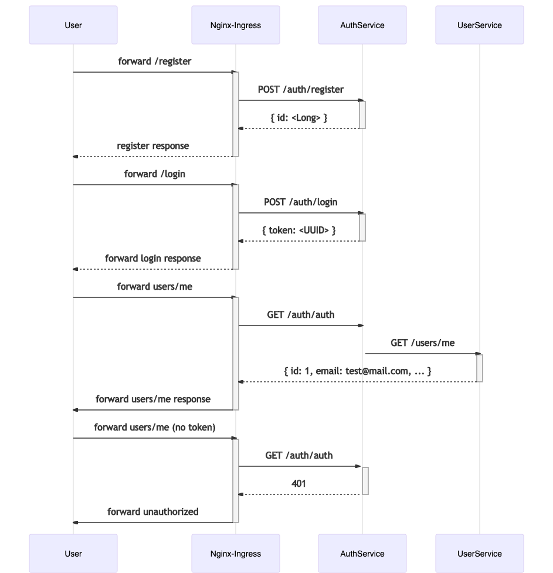

```bash

minikube addons enable ingress

kubectl create namespace dev
kubectl config set-context --current --namespace=dev

cd hw5/charts
helm install auth-service ./auth-service-chart --atomic
helm install user-service ./user-service-chart --atomic

cd ../
newman run auth_api_postman_collection.json -e dev.postman_environment.json


```

ingress auth-url
```bash

http://<service>.<namespace>.svc.cluster.local:<port>/

```

Auth forward sequence diagram

