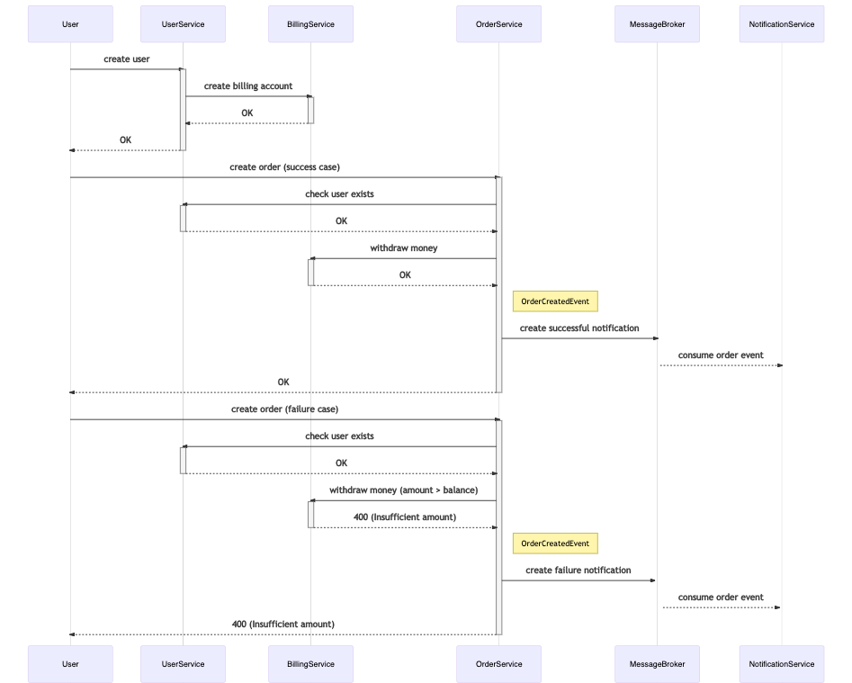

## Installation

```bash

cd hw6

kubectl create namespace messaging
kubectl config set-context --current --namespace=messaging

helm repo add bitnami https://charts.bitnami.com/bitnami
helm install zookeeper bitnami/zookeeper --set replicaCount=1 --set auth.enabled=false --set allowAnonymousLogin=true --atomic
helm install kafka bitnami/kafka --set zookeeper.enabled=false --set replicaCount=1 --set externalZookeeper.servers=zookeeper.messaging.svc.cluster.local --atomic

kubectl create namespace dev
kubectl config set-context --current --namespace=dev

helm install user-service charts/user-service --atomic
helm install billing-service charts/billing-service --atomic
helm install order-service charts/order-service --atomic
helm install notification-service charts/notification-service --atomic

kubectl create namespace monitoring
helm repo add ingress-nginx https://kubernetes.github.io/ingress-nginx/
helm install nginx stable/nginx-ingress --namespace monitoring -f nginx-ingress.yaml

newman run postman/order.postman_collection.json -e postman/dev.postman_environment.json

```

## PORTS
* billing-service: 8000
* order-service: 8001
* notification-service: 8002
* user-service:8003

## Notes 
### If you're on a mac using the hyperkit driver, here's a workaround to change memory or cpu without deleting your vm:

```bash
minikube stop
edit $HOME/.minikube/machines/minikube/config.json, change "Driver.CPU" and/or "Driver.Memory"
minikube start
```

## Create order sequence diagram

